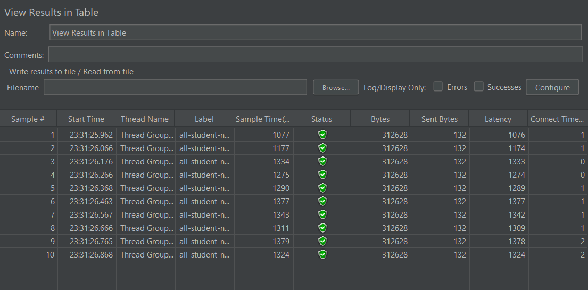
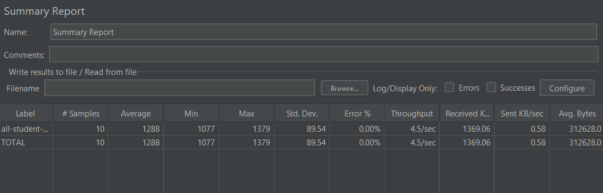
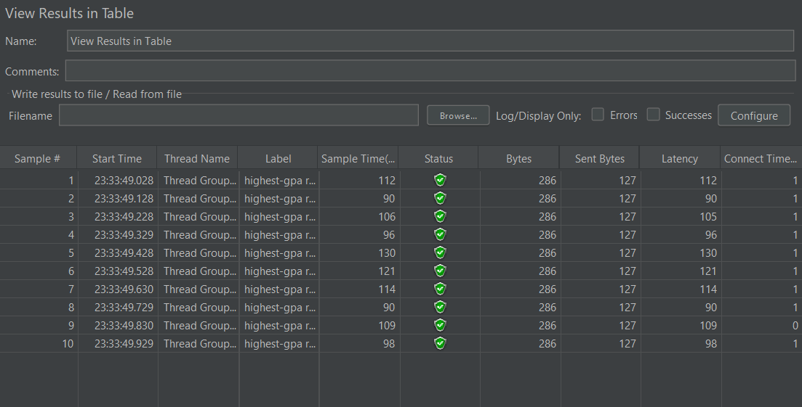
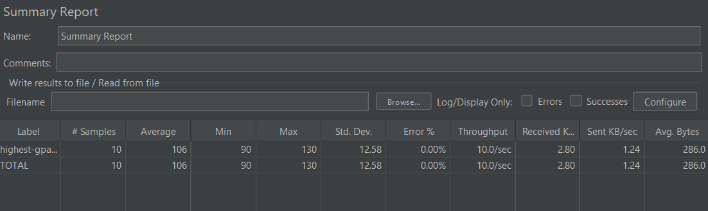
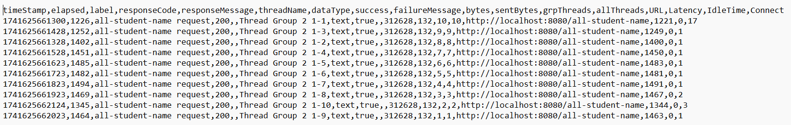
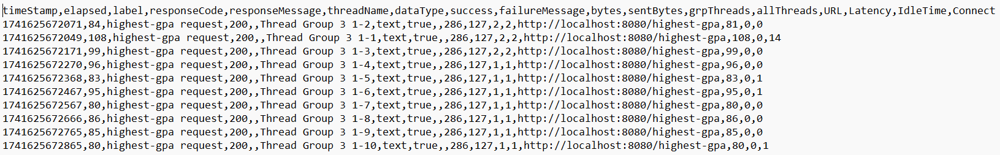
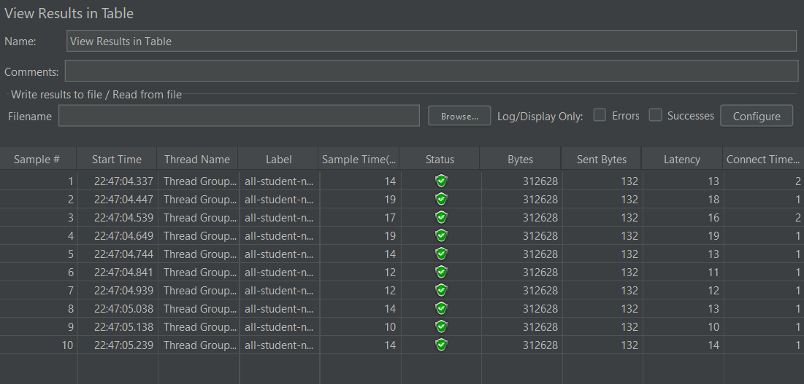
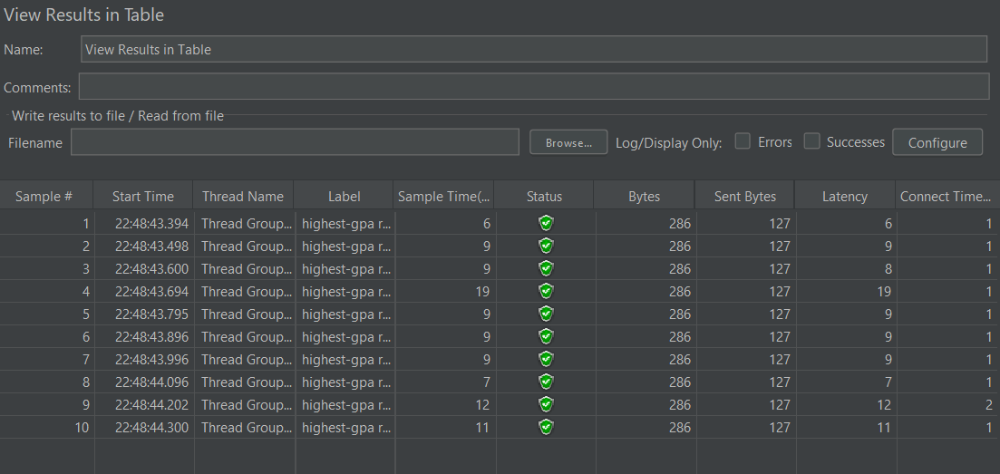

## Module 5
### Screenshots of Request Results

---

/all-student-name - Table:

---

/all-student-name - Summary Report:

---

/highest-gpa - Table:

---

/highest-gpa - Summary Report:

---

### Screenshots of Command Line Results

---

/all-student-name - Command Line:

---

/highest-gpa - Command Line:

---

### After Optimization

/all-student-name:

The performance improved a lot after refactoring the code. Previously, the times for each sample were about 1000-1400 ms. After optimization, the sample times went down to 10-20 ms (about a 98%-99% decrease in sample time).

---

/highest-gpa:

The times for each sample were about 90-130 ms. After optimization, the times went down to 5-20 ms. This is a huge performance improvement; about a 85%-95% decrease in the sample time.

---

### Reflection
1. Testing with these two tools, while different, are complementary in optimizing the performance of the application. JMeter focuses on measuring how an application performs under different loads by simulating multiple users and runs. JMeter focuses on external performance characteristics such as sample response times and throughput. JMeter is usually used for load testing (simulating concurrent users), stress testing (pushing the system to failure), and scalability testing (analyzing system behavior as load increases)  On the other hand, IntelliJ Profiler focuses more on providing in-depth analysis into the CPU execution time and runtime behavior. IntelliJ Profiler focuses more on the internal performance characteristics, such as memory leaks and garbage collection. IntelliJ Profiler is usually used for identifying functions that have a slower performance time and analyzing CPU usage.
2. Using profiling, I can get access to the CPU times and total times of each method in the application. The flame graph shows a summary of which methods take the highest execution time. From the flame graph, you can show the method in the method list, and also directly open the file containing the method. This provides a convenient way for refactoring and performance optimization within IntelliJ.
3. I think that the IntelliJ Profiler is a powerful tool for analyzing bottlenecks. The IntelliJ Profiler allows you to analyze how your application uses system resources and pinpoint which part of the application might be spending too much time or consuming excessive memory. IntelliJ Profiler provides detailed insights into individual methods, which helps identify unnecessary computations or inefficient algorithms. IntelliJ also have a user-friendly interface, providing visual representations like graphs and call trees, making it easy to interpret complex data.
4. One of the biggest challenges is that running the profiling may return different results. It may take a longer time when ran for the first time, but takes shorter times on subsequent runs. Even on subsequent runs, the runtimes may be different, so it often may be difficult to figure out the actual time reduction/performance improvement.
5. Using IntelliJ Profiler allows a detailed analysis of the application's resources and find out which part of the code is using too much memory or spending too much time. Additionally, IntelliJ Profiler also provides detailed analysis for each method in the application, allowing the user to potentially figure out which method of the application is consuming too much memory.
6. First, ensure that both tools are running under similar conditions (such as the same hardware and JVM settings). Disable other background processes and debugging tools that may interfere with the performance measurements. IntelliJ Profiler focuses on running only once, whereas JMeter focuses on concurrent users and focuses on the response times and overall system behavior. This difference in perspective may lead to variations in results. Try running them several times, because the performance times may be significantly different from the first few runs.
7. After finding out the methods that caused the slow performance, the three methods involve querying the PostgreSQL database. I modified the methods so that the results are directly obtained using a PostgreSQL query directly instead of manipulating them through Java code. For example, for obtaining all student names separated by commas, I just use an SQL function directly (`STRING_AGG`) instead of getting all student names as a `List` of `Student` objects, and then iterating through all the objects to keep appending the names into a string. Similarly, for finding the student with the highest GPA, I use `LIMIT 1` and `ORDER BY` in the SQL query; using `LIMIT 1` doesn't actually make PostgreSQL sort the entire database. Previously, the method was querying all students, and then iterating through all the students and comparing them to the current max GPA so far.  These changes only modify the retrieval of data from the database; therefore, it does not affect the overall functionality of the application.
